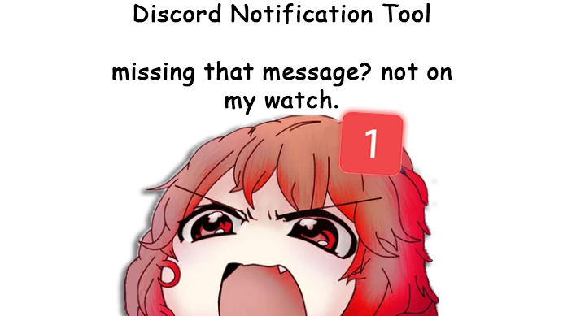

<p align="center">
  
</p>

# 🔔 Discord Notification Tool

> We read the chat so you can touch grass.

<div align="center">


</div>

---

## 📋 Table of Contents

- [Features](#-features)
- [Requirements](#-requirements)
- [Installation](#-installation)
- [Setup](#%EF%B8%8F-setup)
- [Usage](#-usage)
- [Building as EXE](#-building-as-exe)
- [Configuration Reference](#-configuration-reference)
- [Contributing](#-contributing)
- [License](#-license)

---

## ✨ Features

- **Keyword Monitoring** — Define any number of keywords/phrases to watch for across selected channels
- **Push Notifications** — Instant mobile alerts via [ntfy.sh](https://ntfy.sh) (free, no account required)
- **Dark GUI** — Clean, modern dark-themed desktop interface built with PyQt6
- **Multi-Server Support** — Monitors channels across all servers the bot is a member of
- **Persistent Logs** — Keeps up to 200 detection entries with timestamps, channel, author and message content
- **Test Notification** — One-click button to verify your ntfy setup is working
- **Portable EXE** — Build a single `.exe` with the included `build.bat` — no Python required to run

---

## 🖥️ Requirements

- Python **3.10+**
- Windows (for the `.bat` build script; the Python source runs cross-platform)
- A Discord bot token ([How to get one](#%EF%B8%8F-setup))
- The [ntfy app](https://ntfy.sh) on your phone (free)

---

## 📦 Installation

```bash
# 1. Clone the repository
git clone https://github.com/YOUR_USERNAME/discord-notification-tool.git
cd discord-notification-tool

# 2. Install dependencies
pip install -r requirements.txt

# 3. Copy the example config
cp config.json.example config.json

# 4. Run
python main.py
```

---

## ⚙️ Setup

### 1. Create a Discord Bot

1. Go to [discord.com/developers/applications](https://discord.com/developers/applications)
2. Click **New Application** → give it a name
3. Navigate to the **Bot** tab
4. Click **Reset Token** and copy your token
5. Under **Privileged Gateway Intents**, enable **Message Content Intent** ✅
6. Go to **OAuth2 → URL Generator**, select `bot` scope + `Read Messages` permission
7. Open the generated URL to invite the bot to your server

### 2. Set Up ntfy

1. Install the **ntfy** app on your phone ([Android](https://play.google.com/store/apps/details?id=io.heckel.ntfy) / [iOS](https://apps.apple.com/us/app/ntfy/id1625396347))
2. Choose a unique topic name (e.g. `my-discord-alerts-xyz`)
3. Subscribe to `https://ntfy.sh/my-discord-alerts-xyz` in the app

### 3. Configure the Tool

Open the application → go to **Settings** and enter:
- Your **Discord Bot Token**
- Your **ntfy URL** (e.g. `https://ntfy.sh/my-discord-alerts-xyz`)

Click **Save & Apply** to save.

---

## 🚀 Usage

1. **Start the bot** — Click **Start Bot** on the Dashboard
2. **Select channels** — Go to **Channels**, tick the ones you want to monitor, click **Save Selection**
3. **Add keywords** — Go to **Keywords** and type the words/phrases you want to be notified about
4. **Receive alerts** — Whenever a monitored channel contains a keyword, you get a push notification on your phone

The **Logs** page keeps a history of all detections with timestamps, server name, channel, author and message preview.

---

## 📦 Building as EXE

> Produces a standalone `dist/DiscordNotificationTool.exe` — no Python needed to run it.

```bat
build.bat
```

The script will:
1. Check for Python
2. Install all dependencies
3. Clean previous build artifacts
4. Compile with PyInstaller (`--onefile --noconsole`)
5. Copy `config.json` next to the EXE

> ⚠️ **Note:** `config.json` must always be in the same folder as the `.exe`.

---

## 📁 Configuration Reference

The app reads and writes `config.json` automatically. You can also edit it manually:

```jsonc
{
  "token": "YOUR_DISCORD_BOT_TOKEN",        // Bot token from Discord Developer Portal
  "ntfy_url": "https://ntfy.sh/your-topic", // Full ntfy endpoint URL
  "watched_channels": ["123456789"],          // List of Discord channel IDs (strings)
  "keywords": ["keyword1", "sale"],           // Keywords to watch for (case-insensitive)
  "logs": []                                  // Auto-managed detection history (max 200)
}
```

> ⚠️ **Never commit your `config.json`** — it contains your bot token. It is listed in `.gitignore` by default.

---

## 🤝 Contributing

Contributions are welcome! Feel free to:

- Open an **Issue** to report bugs or request features
- Submit a **Pull Request** with improvements

Please keep the code style consistent and test your changes before submitting.

---

## 📄 License

This project is licensed under the [MIT License](LICENSE).

---

<div align="center">

Made with ❤️ by [Ast](https://github.com/YOUR_USERNAME)

</div>
